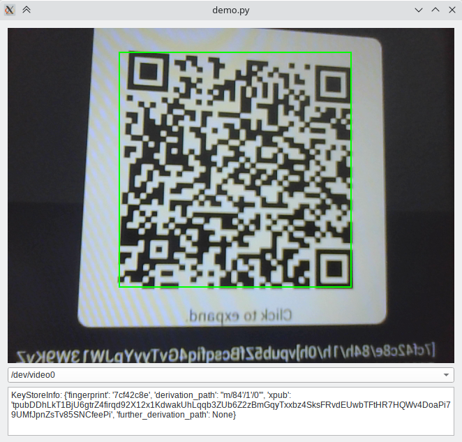

# A python bitcoin qr reader

* Recognizes (and classifies)
  * Addresses  (also BIP21 with amount)
  * Transactions (also base43 electrum encoding)
  * PSBT
  * Xpub
  * Descriptor
  * Partial descriptors (Specter DIY) ( finger print , derivation, xpub)
  * TxId
  * Animated QR Codes ([UR](https://github.com/BlockchainCommons/Research/blob/master/papers/bcr-2020-005-ur.md)) (Transactions and Descriptors)
  * Animated QR Codes (Specter)
* **blazingly fast** recognition
* SLIP132 -> to BIP32 conversion

### Demo

Run the demo with

```
python demo.py
```



# Install package


### From pypi

```shell
pip install bitcoin_qrreader
```


###  From git

```shell
python setup.py sdist bdist_wheel
pip install dist/bitcoin_qrreader*.whl  
```


