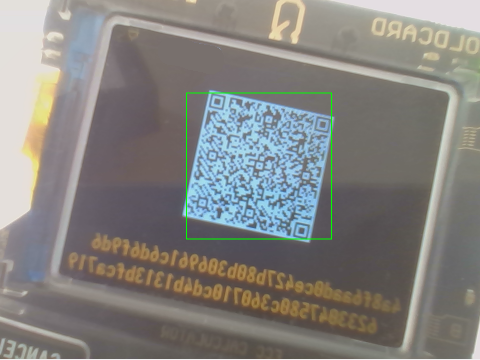
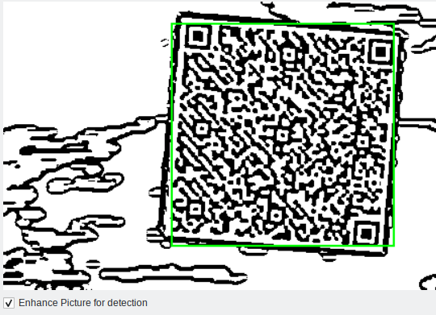

# Bitcoin qr tools

* `BitcoinVideoWidget` recognizes (and classifies)  **blazingly fast**  
  * Addresses  (also BIP21 with amount)
  * Transactions (also base43 electrum encoding)
  * PSBT
  * Xpub
  * Descriptor
  * Multipath Descriptor (like Sparrow)
  * Partial descriptors (Specter DIY) (finger print , derivation, xpub)
  * TxId
  * SignerInfo(s) for Hardware Signer Exports (Wallet Export)
  * Animated QR Codes (BBQR), used by Coldcard
  * Animated QR Codes ([UR](https://github.com/BlockchainCommons/Research/blob/master/papers/bcr-2020-005-ur.md)), used by Foundation Passport, Keystone
  * Animated QR Codes used by Specter DIY
* Recognizes (and classifies)  **blazingly fast**  
* Animated QR Code generation via  `UnifiedEncoder.generate_fragments_for_qr()`
  * For BBQR, UR, and Specter DIY
* QR Code Widgets, via the widgets `QRCodeWidget`,  `QRCodeWidgetSVG`

### Demo

Run the demo with

```
python demo_reader.py
```

### Detection even in bad light contitions and bad camera



### Automatic image enhancement for bright hardware signer screens



# Install package

### From pypi

```shell
pip install bitcoin_qr_tools
```

### From git

* Setup poetry and install dependencies 
  
  ```sh
  curl -sSL https://install.python-poetry.org | python3 -  # see https://python-poetry.org/docs/master/#installing-with-the-official-installer
  poetry config virtualenvs.in-project true
  poetry install
  ```

* Run  
  
  ```sh
  poetry shell
  python -m bitcoin_qr_tools
  ```

# Licences

The python files in *bitcoin_qr_tools*  are under the [GPL3](LICENSE).

The folder *bitcoin_qr_tools/ur* is from https://github.com/Foundation-Devices/foundation-ur-py  and under   [BSD-2-Clause Plus Patent License](ur/LICENSE).

The folder *bitcoin_qr_tools/urtypes* from https://github.com/selfcustody/urtypes  is under  [MIT](urtypes/LICENSE.md).
